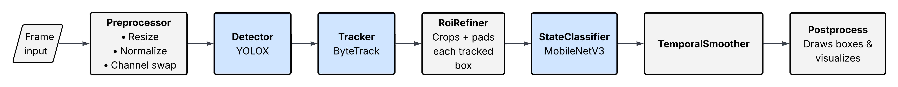

## Summary

This project implements multimodal computer vision pipeline that can detect traffic lights from dashcam footage. The central object detection model is YOLOX by Ultralytics paired with Bytetrack for lightweight object tracking. An additional classification head predicts the traffic light color utilizing MobileNetV3.

## Demo

## Project Highlights
- Object detection and tracking
- Uses a widely available / adopted sensory peripheral
- Lightweight classification model specialized for the simpler facet of the task
- Multimodular pipeline designed for swappable models
- Evaluation pipeline with comprehensive metrics broken down by input data characteristics
- Designed for edge deployment

## Architecture

## Results

## Future Work

